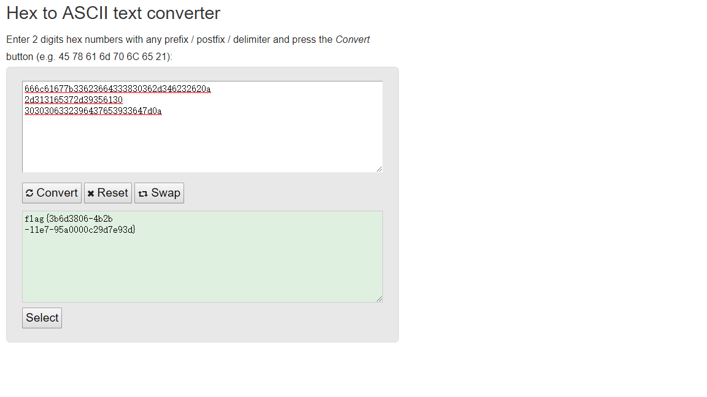

## 题目名称：rsa256

### 解题思路
用`openssl`提取出`n`和`e`

```shell
root@kali:~/CTF# openssl rsa -pubin -text -modulus -in warmup -in public.key 
Public-Key: (256 bit)
Modulus:
    00:d9:9e:95:22:96:a6:d9:60:df:c2:50:4a:ba:54:
    5b:94:42:d6:0a:7b:9e:93:0a:ff:45:1c:78:ec:55:
    d5:55:eb
Exponent: 65537 (0x10001)
Modulus=D99E952296A6D960DFC2504ABA545B9442D60A7B9E930AFF451C78EC55D555EB
writing RSA key
-----BEGIN PUBLIC KEY-----
MDwwDQYJKoZIhvcNAQEBBQADKwAwKAIhANmelSKWptlg38JQSrpUW5RC1gp7npMK
/0UceOxV1VXrAgMBAAE=
-----END PUBLIC KEY-----
```

用`yafu`解出`p`和`q`
```
PS C:\Users\Jam\Downloads\yafu-1.34> .\yafu-x64.exe "factor(@)" -batchfile n.txt


=== Starting work on batchfile expression ===
factor(98432079271513130981267919056149161631892822707167177858831841699521774310891)
=============================================
fac: factoring 98432079271513130981267919056149161631892822707167177858831841699521774310891
fac: using pretesting plan: normal
fac: no tune info: using qs/gnfs crossover of 95 digits

starting SIQS on c77: 98432079271513130981267919056149161631892822707167177858831841699521774310891

==== sieving in progress (1 thread):   36224 relations needed ====
====           Press ctrl-c to abort and save state           ====
36191 rels found: 18129 full + 18062 from 191322 partial, (5492.33 rels/sec))

SIQS elapsed time = 39.6012 seconds.
Total factoring time = 39.6404 seconds


***factors found***

P39 = 325045504186436346209877301320131277983
P39 = 302825536744096741518546212761194311477

ans = 1

eof; done processing batchfile
```

解密后的hex如下，注意到有部分无效的字符，要去掉才能显示真正的答案。

```
0x25a8007e9ad2809abbf5a00666c61677b33623664333830362d346232620aL
0x2d2b97b6ea0d9e5169e1bc14c48a0dbec54002d313165372d393561302d0aL
0x2654ee6244371f5442b4fc8b96d7f2f003030306332396437653933647d0aL
```



### 参考

https://www.ichunqiu.com/writeup/detail/693